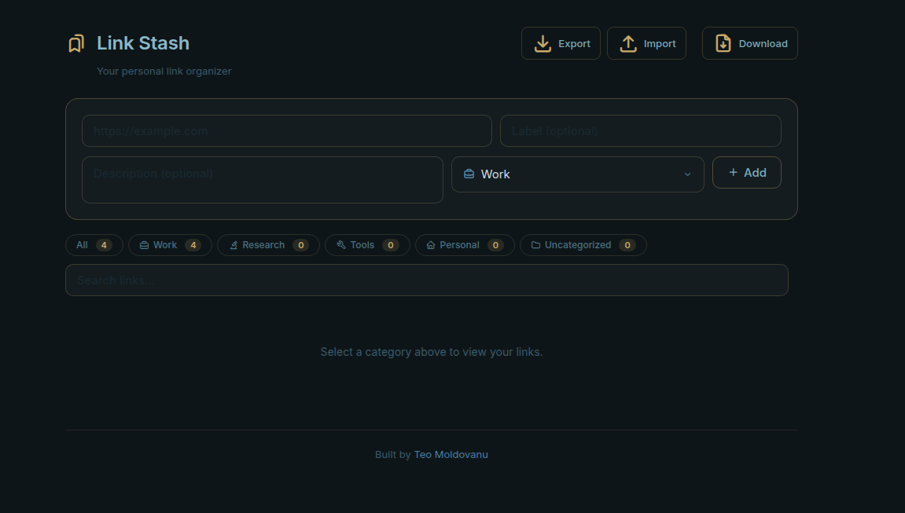

# Link Stash

**One place for all your links. Find them fast, copy them instantly.**

If you constantly juggle URLs across browser tabs, notes apps, and scattered bookmarks – Link Stash is a simpler alternative.

Browser bookmarks are hard to search and have no descriptions. Every dedicated bookmarking tool requires an account. Link Stash is a single HTML file organized by category, searchable, and friendly to use.

**It's useful if you're:**
- Job searching and need to track company pages, application portals, and recruiter profiles
- Doing research and collecting sources across multiple sessions
- Managing a project and keeping tools, docs, and references in one place
- Working across multiple browsers with fragmented bookmarks
- Anyone who pastes URLs into other things constantly and wants them fast

No account. No server. No tracking. Your data stays on your machine.

---

## What it does

- Save links with a label, description, and category
- Organize into categories: Work, Research, Tools, Personal, Uncategorized – or create your own
- Search and filter instantly across all your links
- Click a link to open it, one click to copy the URL
- Export your data as a JSON backup, import it on any other browser or machine
- Works fully offline after download

## How to use

1. Download `link-stash.html` from this repo or click **Download** inside the tool
2. Open it in any browser – drag and drop, or File → Open
3. Start saving links

No installation. No dependencies. No data leaves your machine.

## Moving your links between browsers

Click **Export** to download a JSON backup of all your links. On any other browser or machine, open `link-stash.html` and click **Import** to restore everything. Existing data is replaced by the imported file.

## Built with

- Vanilla JS, HTML, CSS – no frameworks
- [Inter](https://fonts.google.com/specimen/Inter) font
- [Tabler Icons](https://tabler.io/icons)
- `localStorage` for persistence

## License

MIT – do whatever you want with it.

---

Built by [Teo Moldovanu](https://teokitten.github.io)
